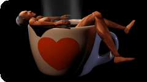
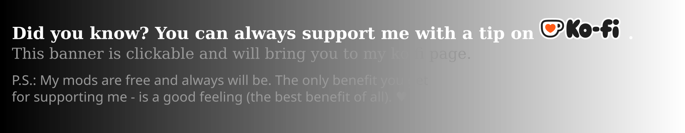
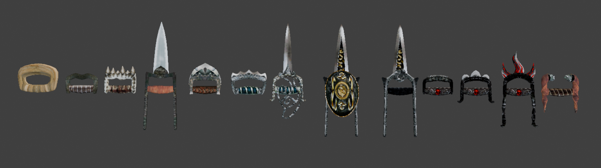

# ⚔ Katars and Knuckledusters

Hand-to-hand weapons for OpenMW. Strap a blade or a set of knuckles to your fists and fight with the
**Hand to Hand** skill - your punches, only with some steel in them.

**13 weapons**: 5 katars and 8 sets of knuckledusters, in wood, chitin, iron, steel, silver, orcish,
ebony and daedric. **3 of them are rare**, with a trick of their own each - finding them and working
out what they do is up to you. The rest turn up the way ordinary weapons do: in merchants' stock, on
NPCs and in chests.

For conjurers there is **Bound Fist**, a new conjuration spell that binds a daedric hand-to-hand
weapon to your fists. Which weapon you get depends on your Conjuration - there are visually different
ones to reach as your skill grows. A few spell merchants teach it.

Developed for OpenMW. **Requires OpenMW 0.51+**.

 

## ⚔ What they do

- The game files katars under Short Blade and knuckledusters under Blunt Weapon, but you fight with
  both using **Hand to Hand**: it decides whether you hit, and it gets most of the experience.
  Keeping the weapon skill up is worth a small bonus.
- Every hit also bruises like a punch, wearing the target's fatigue down until they drop - and once
  they are down, it hurts. Katars cut harder, knuckledusters bruise harder.
- A second copy of the weapon goes in your off hand, and they move and fight with ReAnimation's
  hand-to-hand animations.

Spoiler: what they all look like

If you would rather spoil the fun and see every katar and knuckleduster before you find them, here
they are:

## ⚔ How to install

**Requires OpenMW 0.51+**

1) Install the dependencies: [ReAnimation](https://www.nexusmods.com/morrowind/mods/52596) (3.2 or
newer) and [Max Yari's Script Services (MSS)](https://www.nexusmods.com/morrowind/mods/60256).

2) Install this mod **with a mod organiser**: download the archive and drag and drop it into your mod
organiser of choice (e.g [Mod Organizer 2](https://github.com/ModOrganizer2/modorganizer/releases)
on Windows or [Nerevarine Organizer](https://github.com/grazelandsnomad/nerevarine_organizer/releases/tag/v0.70)
on Linux).
**Or**: [read this tutorial](https://modding-openmw.com/tips/installing-mods/) on how to install mods
using the launcher or completely manually (it's also very easy).

3) Enable these in the "Content Files" tab of the OpenMW launcher, after ReAnimation:
   - `Katar.omwaddon`
   - `H2HWeapons.omwscripts`
   - `H2HWeapons_SpellTraders.omwscripts` - optional, it is what lets spell merchants teach Bound Fist.

4) OpenMW Launcher -> Settings -> Visuals -> Animations: "Use Additional Animation Sources" must be
enabled.

5) The weapons are added to the game's loot and merchant lists. If you use other mods that add to
those lists too, merge your lists once your load order is set, as you would for any such mods:
   - Windows: [TES3Merge](https://github.com/NullCascade/TES3Merge) or
     [DeltaPlugin](https://gitlab.com/bmwinger/delta-plugin)
   - Linux: [DeltaPlugin](https://gitlab.com/bmwinger/delta-plugin)

6) If you have the launcher's "Strength influences hand to hand" option on (Settings -> Gameplay),
set the mod's copy of it to match: Options -> Scripts -> Katars and Knuckledusters. The rest of the
mod's settings are there too.

Optional:
- [Inventory Extender](https://www.nexusmods.com/morrowind/mods/59205) - shows the Hand to Hand type
  and the fatigue damage in weapon tooltips.
- [Unofficial Tamriel Rebuilt Spells](https://www.nexusmods.com/morrowind/mods/58693) - Bound Fist
  then grows stronger with your Conjuration, following that mod's bound item settings (turn on its
  "Scale bound items").
- **PBR**: the weapons come with PBR maps (normal and specular), so metal and crystal catch the light
  properly under [Wareya's PBR shaders](https://github.com/wareya/OpenMW-PBR/tree/0.51) - a small
  replacement for OpenMW's own lighting shaders. Recommended together with
  [Aesthetically Shiny Things](https://www.nexusmods.com/morrowind/mods/52114), which gives the rest
  of the game the same treatment. None of it is required: without them the weapons look fine with
  OpenMW's default shaders.

Have fun!

## ⚔ Mod compatibility

- **Skeleton and body replacers**: compatible - no skeleton is replaced.
- **Tamriel Rebuilt**: its spell merchants teach Bound Fist too.
- **[Oblivion-Style Spell Casting](https://www.nexusmods.com/morrowind/mods/58653)**: supported.
- **Retextures**: vanilla textures are used as they are, so retexture packs carry over.
- **Other animation mods**: fine, unless they also replace ReAnimation's one-handed attacks while a
  katar or knuckleduster is in hand.

## ⚔ Credits

- Meshes, animations and scripts: Max Yari
- Textures: Bethesda (Morrowind, Tribunal)
- NIF library: [Greatness7](https://github.com/Greatness7/io_scene_mw)
- ["Rose"](https://skfb.ly/oWDnS) by Lisa3Dart - Hespera_3d is licensed under
  [Creative Commons Attribution](http://creativecommons.org/licenses/by/4.0/).

## ⚔ For modders

The mod exposes a small interface, `I.H2HWeapons`, for asking what kind of hand-to-hand weapon an item
is. How everything works - and how to build the plugin, meshes and animations from source - is written
up in the [technical notes](Sources/DEVELOPMENT.md) in the git repository.
