# Katars and Knuckles


Fully integrated class of Hand-to-hand weapons for OpenMW. Katars and Knuckles. They mostly use a **Hand to Hand** skill but also receive a small bonus from blunt/blade skill. Same goes for skill leveling.

**16 weapons**: 7 katars and 9 sets of knuckledusters across different materials and rarities of the base game, Tribunal and Bloodmoon. **3 of them are unique** with 2 of those having a truly original custom enchantments. All the weapons are distributed through the world in a fashion similar to original gear - can be found in random enemy loots, chests, merchants or in a few hand-picked locations in the world. Uniques can only be found in the world.

A matching conjuration spell - a **Bound Fist** - allows to summon bound fist weapons with their look changing depending on your conjuraion level.

Developed for OpenMW. **Requires OpenMW 0.51+**.

<p><a href="https://ko-fi.com/maxyari"></a><a href="https://ko-fi.com/maxyari"></a><br><a href="https://ko-fi.com/maxyari"></a></p>

## What they do

- "Officially" Katars are shortblades and knuckledusters are blunt weapons, that's what you will see on a tooltip in the world. Don't trust that - they use and level Hand to Hand and they also damage victim's stamina akin to regular H2H. Note that tooltips should be correct in your inventory or inside containers if you are using [Inventory Extender](https://www.nexusmods.com/morrowind/mods/59205) and/or [QuickLoot](https://www.nexusmods.com/morrowind/mods/54950)
- Yet contrary to regular H2H they also deal damage, albeit small. In general knuckledusters deal lower physical damage but higher stamina damage and Katars are the opposite.
- The new weapons are added to the game's levelled lists - the ones merchants' stock, chests and loot, and NPCs' and enemies' weapons are rolled from - so they turn up as ordinary weapons of their material do: now and then, not in every shop. Uniques are... well... unique and need to be found in the world.
- Conjured fist weapons change their looks based on your conjuration skill.
- They take both hands, same as bare fists: your shield or torch comes off while they are out and goes back on once you put them away.
- NPCs use them too, off-hand weapon and all - and so do armed creatures like dremora and skeletons. In third person the weapons have their own animations.

If you want to know more details and know what to expect, look under the spoiler below, otherwise just play the game :)
It's safe to open: everything inside is organised into smaller spoilers - every material has its own, and so does every unique's location - so you only see what you click on.

<details>
<summary>Spoilers (safe to open, everything inside is in its own smaller spoiler)</summary>

**What the weapons look like**

<details>
<summary>Iron</summary>

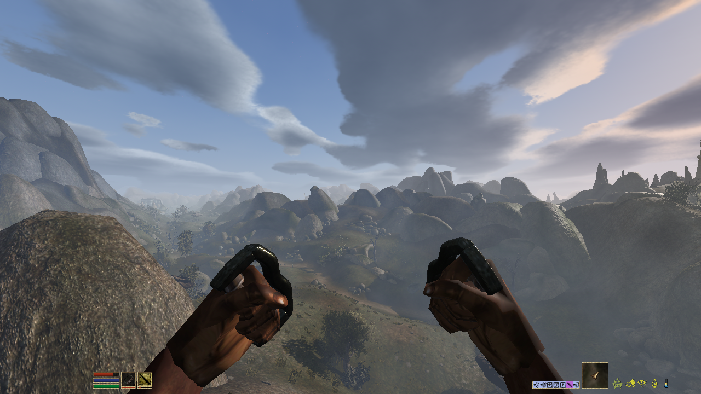

</details>

<details>
<summary>Steel</summary>

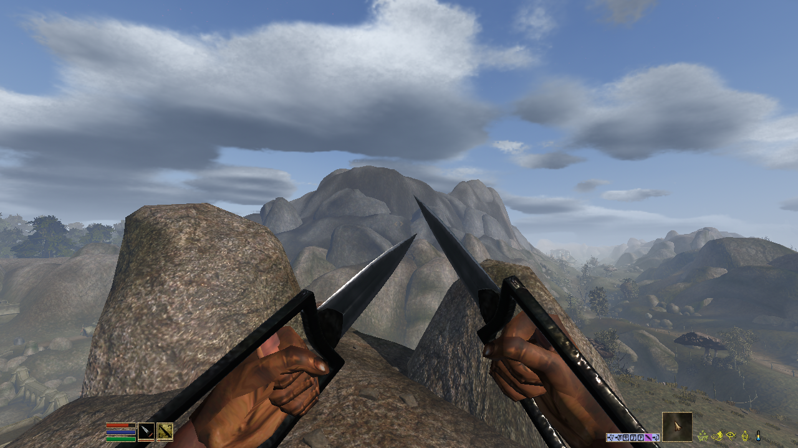

</details>

<details>
<summary>Silver</summary>

Silver Katars

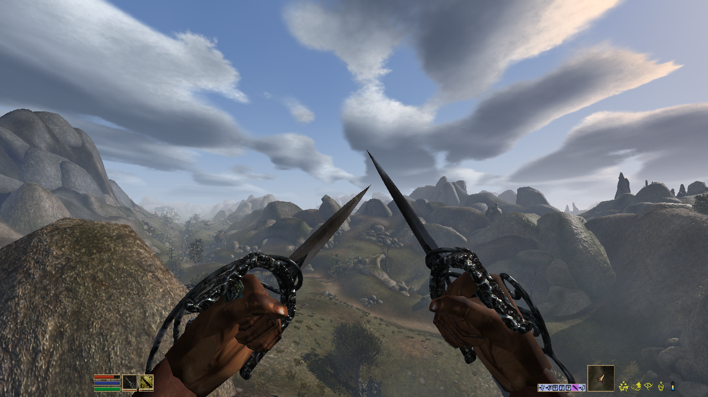

Silver Knuckles

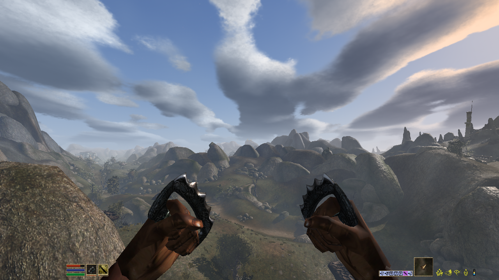

</details>

<details>
<summary>Nordic Silver</summary>

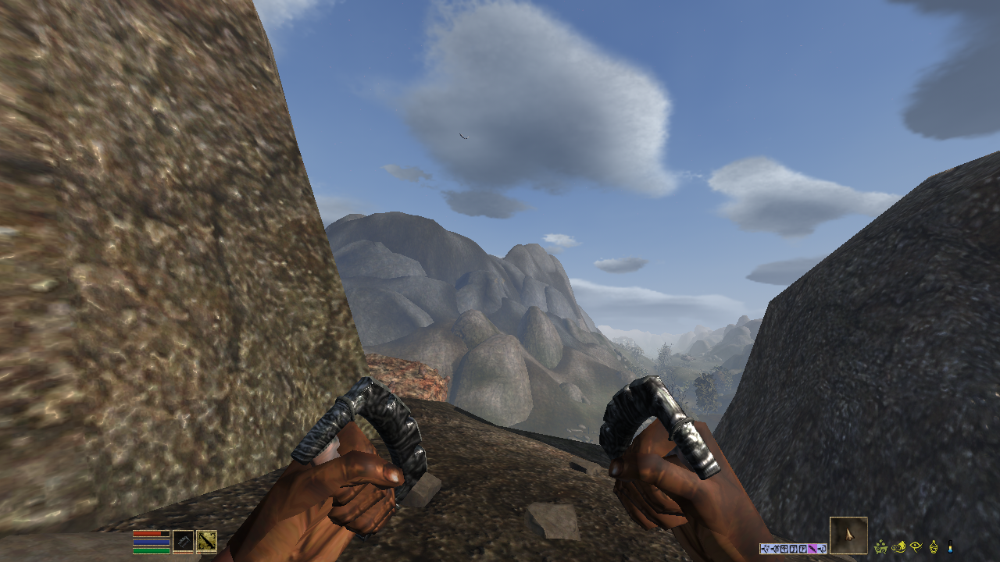

</details>

<details>
<summary>Orcish</summary>

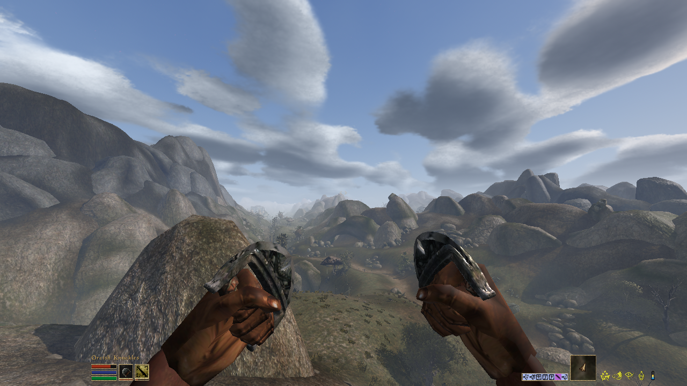

</details>

<details>
<summary>Glass</summary>

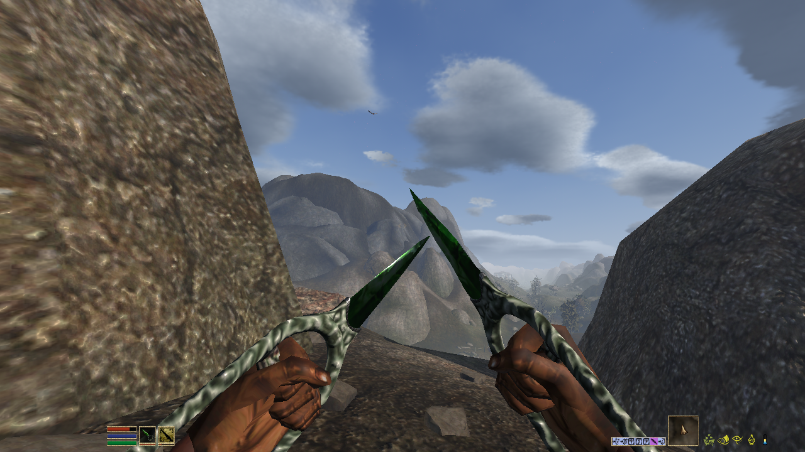

</details>

<details>
<summary>Ebony</summary>

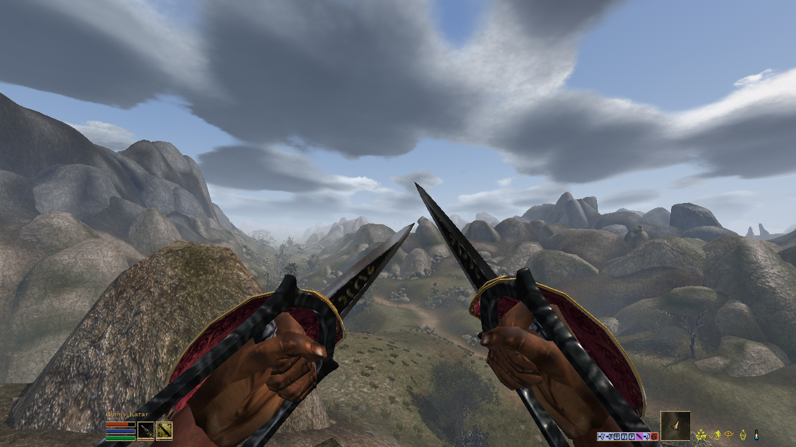

</details>

<details>
<summary>Adamantium</summary>

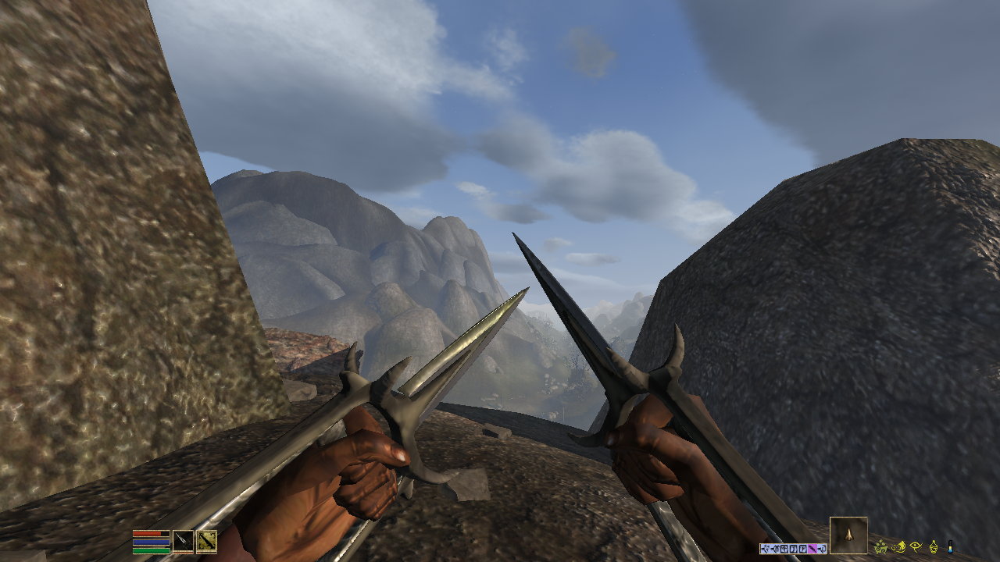

</details>

<details>
<summary>Daedric</summary>

Daedric Katars

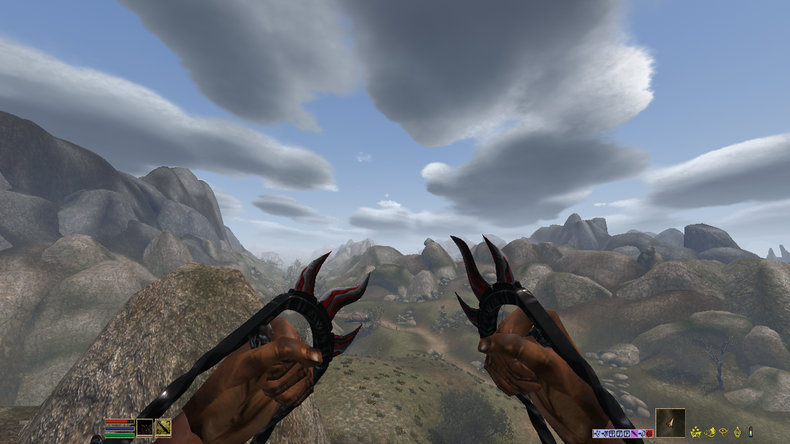

Daedric Knuckles

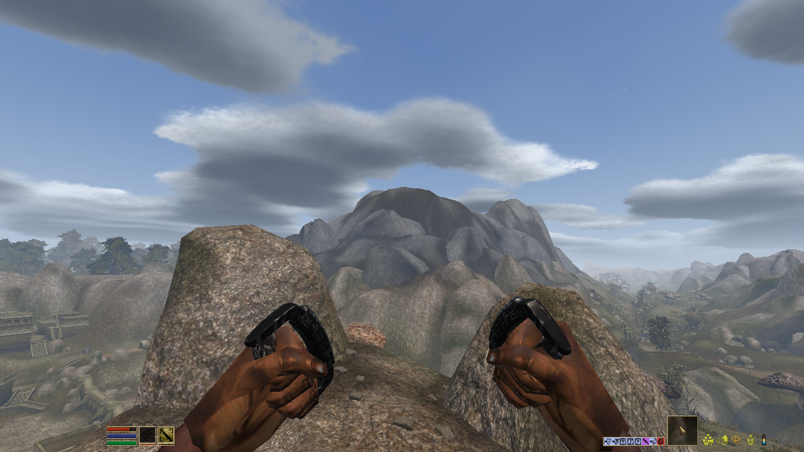

Daedric Spiked Knuckles

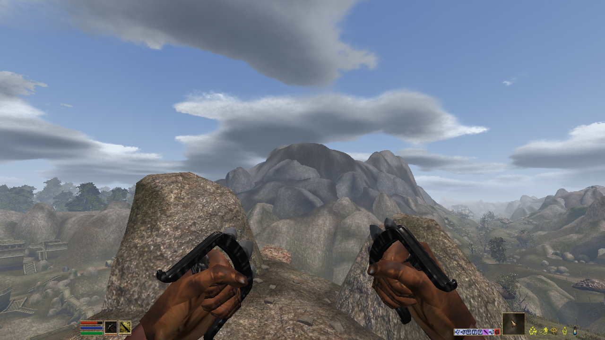

</details>

**Where to find the uniques** (each one opens with a vague tip, the exact location is a spoiler inside it)

<details>
<summary>The lesser unique</summary>

The lesser of uniques (barely a unique) is made of driftwood by someone with a lot of time on their hands to watch ships in the sea.

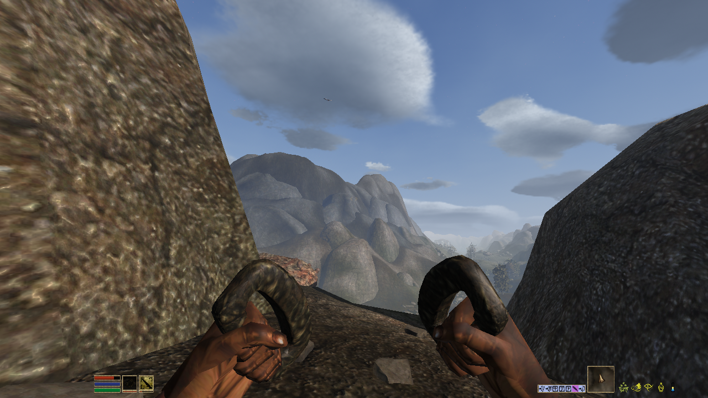

<details>
<summary>Exact location (full spoiler)</summary>

**Driftwood Beaters**: on the bench at the top of the Seyda Neen lighthouse interior.

</details>

</details>

<details>
<summary>The middle unique</summary>

The middle of the uniques is of an arcane origin and as such is drawn to places of high magic. It also rather fancies inland lakes.

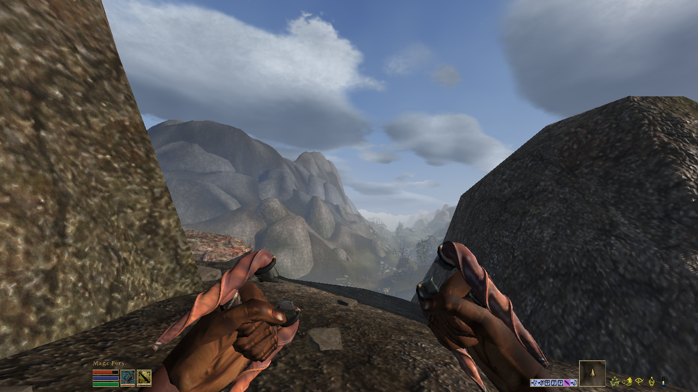

<details>
<summary>Exact location (full spoiler)</summary>

**Mage Fury**: in the room with four pillars in Marandus, Upper Level, on the desk among a collection of
scrolls and potions.

</details>

</details>

<details>
<summary>The highest unique</summary>

The highest of the three is of a dark and vicious nature, its kiss is poison and its owner schemes deep underground.

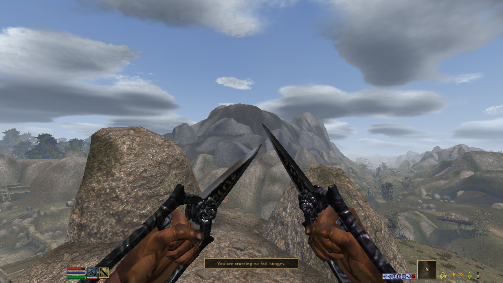

<details>
<summary>Exact location (full spoiler)</summary>

**Ebony Rose**: Old Mournhold, Moril Manor, in the Dark Brotherhood hideout (the location where the local
Brotherhood leader, Dandras Vules, resides). If [Mercy: CAO](https://www.nexusmods.com/morrowind/mods/55064)
is installed, Dandras himself will carry and use them; if not, the Ebony Rose katars can be found on a stool
beside the fire, in the little corner where Dandras is found.

</details>

</details>

</details>

## Recommended mods

- [The Combat Juice](https://www.nexusmods.com/morrowind/mods/60362), also by me - a layer of
  subtle "oomph" all over the combat, visual and audible, without touching any mechanics - every
  punch feels like it lands.
- [Inventory Extender](https://www.nexusmods.com/morrowind/mods/59205) - shows the Hand to Hand type
  and the fatigue damage in weapon tooltips.
- [QuickLoot](https://www.nexusmods.com/morrowind/mods/54950) - its loot tooltips show them too.
- [Combat Sounds Overhaul Overhauled](https://www.nexusmods.com/morrowind/mods/60361), also by me - katars swing with a fist's
  whoosh and a blade's under it, knuckledusters with a fist's. Load
  [Combat Sounds Overhaul](https://www.nexusmods.com/morrowind/mods/53859) above `Katars&Knuckles.omwscripts`.


## How to install

**Requires OpenMW 0.51+**

1) Install the dependencies: [ReAnimation](https://www.nexusmods.com/morrowind/mods/52596) (3.3 or
newer) and [Max Yari's Script Services (MSS)](https://www.nexusmods.com/morrowind/mods/60256).

2) Install this mod **with a mod organiser**: download the archive and drag and drop it into your mod
organiser of choice (e.g. [Mod Organizer 2](https://github.com/ModOrganizer2/modorganizer/releases)
on Windows or [Nerevarine Organizer](https://github.com/grazelandsnomad/nerevarine_organizer/releases/tag/v0.70)
on Linux).
**Or**: [read this tutorial](https://modding-openmw.com/tips/installing-mods/) on how to install mods
using the launcher or completely manually (it's also very easy).
The archive has two folders: `00 Core` is the mod and `01 Glass Glowset Patch` is an optional patch
(see Optional below). Mod organisers show an installer that explains them. If you install by hand,
add `00 Core` as the data folder, and `01 Glass Glowset Patch` after it if you want it.

3) Enable these in the "Content Files" tab of the OpenMW launcher, after [ReAnimation](https://www.nexusmods.com/morrowind/mods/52596):
   - `Katars&Knuckles.omwaddon` - needs Tribunal and Bloodmoon.
   - `Katars&Knuckles_WorldPlacements.omwaddon` - puts the rare weapons, and a few others, in the world. Needs
     Tribunal and Bloodmoon.
   - `Katars&Knuckles_TamrielRebuilt.omwaddon` - only with [Tamriel Rebuilt](https://www.nexusmods.com/morrowind/mods/42145), after it: puts the
     weapons in Tamriel Rebuilt's levelled lists too. Needs [Tamriel Data](https://www.nexusmods.com/morrowind/mods/44537).
   - `Katars&Knuckles.omwscripts`
   - `Katars&Knuckles_Conjuration.omwscripts` - adds a corresponding conjuration spell and mechanics to some spell mentors.

4) OpenMW Launcher -> Settings -> Visuals -> Animations: "Use Additional Animation Sources" must be
enabled.

5) The weapons are added to the game's levelled lists - the ones merchants' stock, loot and enemies'
weapons are rolled from. If you use other mods that edit those lists too, merge your lists once your
load order is set, as you would for any such mods:
   - Windows: [TES3Merge](https://github.com/NullCascade/TES3Merge) or
     [DeltaPlugin](https://gitlab.com/bmwinger/delta-plugin)
   - Linux: [DeltaPlugin](https://gitlab.com/bmwinger/delta-plugin)

6) If you have the launcher's "Factor Strength into Hand-to-Hand Combat" option on (Settings -> Gameplay),
set the mod's copy of it to match: Options -> Scripts -> Katars and Knuckledusters. The rest of the
mod's settings are there too.

Optional:
- [Unofficial Tamriel Rebuilt Spells](https://www.nexusmods.com/morrowind/mods/58693) - Bound Fist
  then grows stronger with your Conjuration, following that mod's bound item settings (turn on its
  "Scale bound items").
- **PBR**: the weapons come with PBR maps (normal and specular), so metal and crystal catch the light
  properly under [Wareya's PBR shaders](https://github.com/wareya/OpenMW-PBR/tree/0.51) - a small
  replacement for OpenMW's own lighting shaders. Recommended together with
  [Aesthetically Shiny Things](https://www.nexusmods.com/morrowind/mods/52114), which gives the rest
  of the game the same treatment. OpenMW only picks the maps up with "Auto Use Object Normal Maps" and
  "Auto Use Object Specular Maps" on (launcher: Settings -> Visuals -> Shaders). None of it is
  required: without them the weapons look fine with OpenMW's default shaders.
- [Glass Glowset](https://www.nexusmods.com/morrowind/mods/42762): tick "Glass Glowset Patch" in the
  installer (or add the `01 Glass Glowset Patch` folder after `00 Core`) and the glass katars fit its
  style - they glow like the rest of the glass set. Needs Glass Glowset installed.

Have fun!

## Mod compatibility

- **Skeleton and body replacers**: compatible - no skeleton is replaced.
- **[Tamriel Rebuilt](https://www.nexusmods.com/morrowind/mods/42145)**: its spell merchants teach Bound Fist too, and with
  `Katars&Knuckles_TamrielRebuilt.omwaddon` its merchants, chests and NPCs deal the weapons as vanilla's do.
- **[Oblivion-Style Spell Casting](https://www.nexusmods.com/morrowind/mods/58653)**: supported.
- **Retextures**: vanilla textures are used as they are, so retexture packs carry over. [Glass Glowset](https://www.nexusmods.com/morrowind/mods/42762)
  also puts its glow in the meshes; the optional patch above gives the glass katars theirs.
- **Other animation mods**: fine, unless they also replace [ReAnimation](https://www.nexusmods.com/morrowind/mods/52596)'s one-handed attacks while a
  katar or knuckleduster is in hand.

## Credits

- Meshes, animations and scripts: Max Yari
- Textures: Bethesda (Morrowind, Tribunal, Bloodmoon)
- Detail normal map in the baked metals: [Metal 061 B](https://ambientcg.com/view?id=Metal061B) from
  ambientCG, CC0
- Glow maps of the Glass Glowset patch: Solidfire's [Glass Glowset](https://www.nexusmods.com/morrowind/mods/42762)
  (not included - the patch uses them from that mod)
- NIF library: [Greatness7](https://github.com/Greatness7/io_scene_mw)
- ["Rose"](https://skfb.ly/oWDnS) by Lisa3Dart - Hespera_3d is licensed under
  [Creative Commons Attribution](http://creativecommons.org/licenses/by/4.0/).

## For modders

Your own weapons can work the way katars and knuckledusters do - or be a different kind of hybrid: a
mace that trains Blunt Weapon and Destruction, a spear only as good as the weaker of Spear and
Conjuration. No scripting needed, one small definition file per weapon. All of it is documented in the
[git repository](https://github.com/MaxYari/Katars-KnucklesOpenMW#for-modders), along with the
mod's source and the tools that build it. If you are already reading this on git - just read below.

<!-- nexus-skip-start -->
### Hybrid weapons

Make the weapons in your plugin as usual, and next to it ship one small file per weapon in a
`HybridWeaponDefinitions` folder, named after the weapon's record id:

```
Data Files/
  MyMod.esp
  HybridWeaponDefinitions/
    my_flame_mace.yaml
```

```yaml
# HybridWeaponDefinitions/my_flame_mace.yaml
primarySkill: bluntweapon
secondarySkill: destruction
primaryExperience: 0.7
secondaryExperience: 0.5
scaling: lowestSkill
moveset: default
tooltip: "Battlemage's mace: as effective as the lower of %{primarySkill} (%{primary}) and %{secondarySkill} (%{secondary})."
```

YAML or JSON (`.yaml`, `.yml`, `.json`). Only melee weapons can be hybrids. The record's weapon type
stays what the engine sees - handedness, reach, damage - and whichever skill that type uses is the
one the mod stands in for: on every swing it's set to what the hybrid's skills make, then set back,
and on every hit its experience is handed out by the shares below.

- `primarySkill` (required) - a skill id: `handtohand`, `shortblade`, `bluntweapon`, `destruction`...
  Any spelling works: `Hand to Hand`.
- `secondarySkill` (required) - a different skill.
- `primaryExperience` (default `0.7`) - share of a successful hit's experience for the primary skill:
  `0.7` or `70%`.
- `secondaryExperience` (default `0.3`) - the same for the secondary skill.
- `scaling` (default `minorSecondaryBonus`) - what a swing rolls with: `minorSecondaryBonus` is the
  primary skill plus 15% of the secondary, tapering to 5% as the secondary falls more than 10 points
  behind, `lowestSkill` the lower of the two, `highestSkill` the higher.
- `moveset` (default `default`) - `handToHand`: this mod's fist animations, a copy of the weapon in
  the off hand and nothing else in that hand (one-handed weapons only). `default`: the weapon's own
  animations.
- `fatigueDamage` (default `0`) - fatigue damage per hit, as a share of a bare-fisted punch's. Katars
  `0.5`, knuckledusters `0.75`.
- `silentDraw` (default `false`) - no draw and sheathe sound, like bare hands.
- `swingSounds` (default: the weapon's own) - swing whooshes, with
  [Combat Sounds Overhaul Overhauled](https://www.nexusmods.com/morrowind/mods/60361), a replacement script for [Combat Sounds Overhaul](https://www.nexusmods.com/morrowind/mods/53859)
  (below).
- `tooltip` (default: one for its scaling) - the footnote in Inventory Extender's tooltip
  (placeholders below).

A skill that isn't the weapon's own gets its share as one use of that skill - for a magic school,
one successful cast. The weapon's own skill, if it's neither of the two, gets nothing.

**Tooltip placeholders**: `%{primarySkill}` and `%{secondarySkill}` (their names), `%{primary}` and
`%{secondary}` (the player's values), `%{effective}` (what a swing rolls with), `%{bonus}` (that minus
the primary, as `+3`), `%{lowest}`, `%{highest}`, `%{weaponSkill}` (the skill the engine thinks it
is), `%{primaryExperience}` and `%{secondaryExperience}` (as `70%`).

**Swing sounds** are a list, one whoosh per entry, all played on every swing. `sound` is `own` - the
weapon's own whoosh, from [Combat Sounds Overhaul Overhauled](https://www.nexusmods.com/morrowind/mods/60361)'s swing `groups` if you give some - or one
of that mod's weapon kinds (`HandToHand`, `ShortBlade`, `Blunt`, `Axe`...). `HandToHand` is the
vanilla whoosh a bare fist swings with. Leave `own` out and the weapon's own whoosh is silent.
[Combat Sounds Overhaul](https://www.nexusmods.com/morrowind/mods/53859) has to load above `Katars&Knuckles.omwscripts`. A katar's:

```yaml
swingSounds:
  - sound: HandToHand
    volume: 1
  - sound: own
    volume: 0.85
    groups: [sharpMetal]
```

Good to know:

- This mod's own definitions are in its `HybridWeaponDefinitions` folder, for reference. A file at the
  same path in a mod loaded later replaces this mod's, which is also how to change its weapons.
- A copy of a hybrid made in game - say, one the player enchanted - is recognised by its mesh and type.
- What's wrong with a file goes to `openmw.log` when a game is loaded, on lines starting
  `[H2HWeapons]`.
- NPCs swing hybrids with the skill the engine gives them; the skill swap and the experience are the
  player's.

### Scripts and source

Scripts can ask about hybrids through `I.H2HWeapons` (in player scripts): `hybridOfId(recordId)`,
`hybridOfItem(item)` and `equippedHybrid()` give a weapon's definition, or `false`.

How everything works is written up in the [technical notes](Sources/DEVELOPMENT.md). The plugins,
meshes, textures and animations are all built by scripts, from the Blender files in the repository:
[Sources/Tools/README.md](Sources/Tools/README.md) has the ones for the plugins, animations and
skeletons, [tools/README.md](tools/README.md) the Blender ones for the meshes and textures, and the
release tooling.
<!-- nexus-skip-end -->
