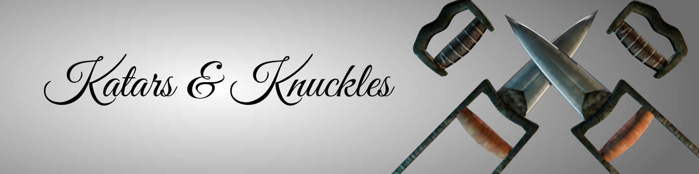
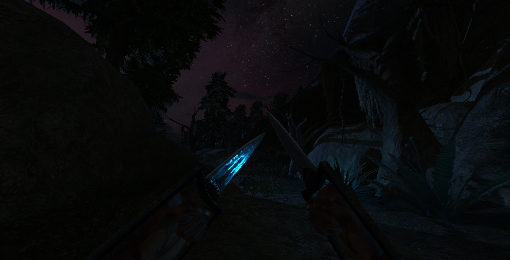
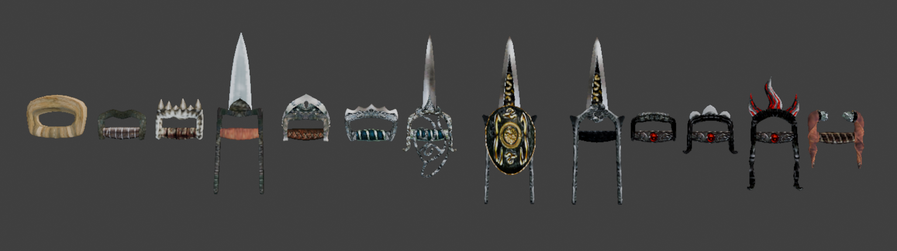

# ⚔ Katars and Knuckles



Hand-to-hand weapons for OpenMW. Katars and Knuckledusters. They mostly use a **Hand to Hand** skill but also receive a small bonus from blunt/blade skill. Same goes for skill leveling.

**16 weapons**: 7 katars and 9 sets of knuckledusters, in wood, chitin, iron, steel, silver,
Nordic silver, adamantium, orcish, glass, ebony and daedric. **3 of them are rare**, with a trick of their own each - finding them and working
out what they do is up to you. The rest turn up the way ordinary weapons do: in merchants' stock, on
NPCs and in chests. Eight of them also come **weakly enchanted** - fire, frost or shock on strike, as
vanilla's Flameblades and Sparkmaces have - from the shops and chests that deal those.

For conjurers there is **Bound Fist**, a new conjuration spell that binds a daedric hand-to-hand
weapon to your fists. Which weapon you get depends on your Conjuration - there are visually different
ones to reach as your skill grows. A few spell merchants teach it.

Developed for OpenMW. **Requires OpenMW 0.51+**.



<p><a href="https://ko-fi.com/maxyari"></a><a href="https://ko-fi.com/maxyari"></a><br><a href="https://ko-fi.com/maxyari"></a></p>

## ⚔ What they do

- "Officially" Katars are shortblades and knuckledusters are blunt weapons, that what you will see on a tooltip in the world. Dont trust that - they use and level Hand to Hand and they also damage victim's stamina akin to regular H2H.
- Yet countrary to regular H2H they also deal damage, albeit small. In general knuckleduster deal lower physical damage but higher stamina damage and Katars are the opposite.
- The new weapons are added to the game's levelled lists - the ones merchants' stock, chests and loot, and NPCs' and enemies' weapons are rolled from - so they turn up as ordinary weapons of their material do: now and then, not in every shop. Uniques are... well... unique and need to be found in the world.
- Conjured fist weapons change their looks based on your conjuration skill.
- They take both hands, same as bare fists: your shield or torch comes off while they are out and goes back on once you put them away.
- NPCs use them too, off-hand weapon and all - and so do armed creatures like dremora and skeletons. In third person the weapons have their own animations - admittedly crude ones, made by merging the first-person moves with vanilla's hand-to-hand legs.

If you want to know more details and know what to expect, look under the spoilers below, otherwise just play the game :)

<details>
<summary>How all the weapons look like</summary>



</details>

<details>
<summary>Where to find uniques (only light spoilers with vague tips)</summary>

- The lesser of uniques (barely a unique) is made of driftwood by someone with a lot of time on their hands to watch ships in the sea.

- The middle of the uniqes is of an arcane origin and as such is drawn to places of high magic. It also rather fancies inland lakes.

- The highest of the three is of a dark and vicious nature, its kiss is poison and its owner schemes deep undergound. 

<details>
<summary>Concrete locations: (full spoilers)</summary>

 Aaaaaaah, you sneaky bastard, I didn't fill this in yet. Go play the game, cmon.

</details>

</details>

## ⚔ Recommended mods

- [The Combat Juice](https://www.nexusmods.com/morrowind/mods/60362), also by me - a layer of
  subtle "oomph" all over the combat, visual and audible, without touching any mechanics - every
  punch feels like it lands.
- [Inventory Extender](https://www.nexusmods.com/morrowind/mods/59205) - shows the Hand to Hand type
  and the fatigue damage in weapon tooltips.
- [QuickLoot](https://www.nexusmods.com/morrowind/mods/54950) - its loot tooltips show them too.


## ⚔ How to install

**Requires OpenMW 0.51+**

1) Install the dependencies: [ReAnimation](https://www.nexusmods.com/morrowind/mods/52596) (3.3 or
newer) and [Max Yari's Script Services (MSS)](https://www.nexusmods.com/morrowind/mods/60256).

2) Install this mod **with a mod organiser**: download the archive and drag and drop it into your mod
organiser of choice (e.g [Mod Organizer 2](https://github.com/ModOrganizer2/modorganizer/releases)
on Windows or [Nerevarine Organizer](https://github.com/grazelandsnomad/nerevarine_organizer/releases/tag/v0.70)
on Linux).
**Or**: [read this tutorial](https://modding-openmw.com/tips/installing-mods/) on how to install mods
using the launcher or completely manually (it's also very easy).

3) Enable these in the "Content Files" tab of the OpenMW launcher, after ReAnimation:
   - `Katar.omwaddon` - needs Tribunal and Bloodmoon.
   - `KatarWorldPlacements.omwaddon` - puts the rare weapons in the world. Needs Tribunal.
   - `KatarTamrielRebuilt.omwaddon` - only with Tamriel Rebuilt, after it: puts the weapons in Tamriel
     Rebuilt's levelled lists too. Needs Tamriel Data.
   - `H2HWeapons.omwscripts`
   - `H2HWeapons_SpellTraders.omwscripts` - optional, it is what lets spell merchants teach Bound Fist.

4) OpenMW Launcher -> Settings -> Visuals -> Animations: "Use Additional Animation Sources" must be
enabled.

5) The weapons are added to the game's levelled lists - the ones merchants' stock, loot and enemies'
weapons are rolled from. If you use other mods that edit those lists too, merge your lists once your
load order is set, as you would for any such mods:
   - Windows: [TES3Merge](https://github.com/NullCascade/TES3Merge) or
     [DeltaPlugin](https://gitlab.com/bmwinger/delta-plugin)
   - Linux: [DeltaPlugin](https://gitlab.com/bmwinger/delta-plugin)

6) If you have the launcher's "Strength influences hand to hand" option on (Settings -> Gameplay),
set the mod's copy of it to match: Options -> Scripts -> Katars and Knuckledusters. The rest of the
mod's settings are there too.

Optional:
- [Unofficial Tamriel Rebuilt Spells](https://www.nexusmods.com/morrowind/mods/58693) - Bound Fist
  then grows stronger with your Conjuration, following that mod's bound item settings (turn on its
  "Scale bound items").
- **PBR**: the weapons come with PBR maps (normal and specular), so metal and crystal catch the light
  properly under [Wareya's PBR shaders](https://github.com/wareya/OpenMW-PBR/tree/0.51) - a small
  replacement for OpenMW's own lighting shaders. Recommended together with
  [Aesthetically Shiny Things](https://www.nexusmods.com/morrowind/mods/52114), which gives the rest
  of the game the same treatment. None of it is required: without them the weapons look fine with
  OpenMW's default shaders.

Have fun!

## ⚔ Mod compatibility

- **Skeleton and body replacers**: compatible - no skeleton is replaced.
- **Tamriel Rebuilt**: its spell merchants teach Bound Fist too, and with `KatarTamrielRebuilt.omwaddon`
  its merchants, chests and NPCs deal the weapons as vanilla's do.
- **[Oblivion-Style Spell Casting](https://www.nexusmods.com/morrowind/mods/58653)**: supported.
- **Retextures**: vanilla textures are used as they are, so retexture packs carry over.
- **Other animation mods**: fine, unless they also replace ReAnimation's one-handed attacks while a
  katar or knuckleduster is in hand.

## ⚔ Credits

- Meshes, animations and scripts: Max Yari
- Textures: Bethesda (Morrowind, Tribunal)
- NIF library: [Greatness7](https://github.com/Greatness7/io_scene_mw)
- ["Rose"](https://skfb.ly/oWDnS) by Lisa3Dart - Hespera_3d is licensed under
  [Creative Commons Attribution](http://creativecommons.org/licenses/by/4.0/).

## ⚔ For modders

### Hybrid weapons for modders

Your own weapons can work the way katars and knuckledusters do - or be a different kind of hybrid: a
mace that trains Blunt Weapon and Destruction, a spear only as good as the weaker of Spear and
Conjuration. No scripting needed. Make the weapons in your plugin as usual, and next to it ship one
small file per weapon in a `HybridWeaponDefinitions` folder, named after the weapon's record id:

```
Data Files/
  MyMod.esp
  HybridWeaponDefinitions/
    my_flame_mace.yaml
```

```yaml
# HybridWeaponDefinitions/my_flame_mace.yaml
primarySkill: handtohand
secondarySkill: destruction
primaryExperience: 0.7
secondaryExperience: 0.5
scaling: lowestSkill
moveset: default
tooltip: "Battlemage's mace: as effective as the lower of %{primarySkill} (%{primary}) and %{secondarySkill} (%{secondary})."
```

YAML or JSON (`.yaml`, `.yml`, `.json`). Only melee weapons can be hybrids. The record's weapon type
stays what the engine sees - handedness, reach, damage - and whichever skill that type uses is the
one the mod stands in for: on every swing it's set to what the hybrid's skills make, then set back,
and on every hit its experience is handed out by the shares below.

- `primarySkill` (required) - a skill id: `handtohand`, `shortblade`, `bluntweapon`, `destruction`...
  Any spelling works: `Hand to Hand`.
- `secondarySkill` (required) - a different skill.
- `primaryExperience` (default `0.7`) - share of a successful hit's experience for the primary skill:
  `0.7` or `70%`.
- `secondaryExperience` (default `0.3`) - the same for the secondary skill.
- `scaling` (default `minorSecondaryBonus`) - what a swing rolls with: `minorSecondaryBonus` is the
  primary skill plus 15% of the secondary, tapering to 5% as the secondary falls more than 10 points
  behind, `lowestSkill` the lower of the two, `highestSkill` the higher.
- `moveset` (default `default`) - `handToHand`: this mod's fist animations, a copy of the weapon in
  the off hand and nothing else in that hand (one-handed weapons only). `default`: the weapon's own
  animations.
- `fatigueDamage` (default `0`) - fatigue damage per hit, as a share of a bare-fisted punch's. Katars
  `0.5`, knuckledusters `0.75`.
- `silentDraw` (default `false`) - no draw and sheathe sound, like bare hands.
- `swingSounds` (default: the weapon's own) - swing whooshes, with Combat Sounds Overhaul Overhauled
  (below).
- `tooltip` (default: one for its scaling) - the footnote in Inventory Extender's tooltip
  (placeholders below).

A skill that isn't the weapon's own gets its share as one use of that skill - for a magic school,
one successful cast. The weapon's own skill, if it's neither of the two, gets nothing.

**Tooltip placeholders**: `%{primarySkill}` and `%{secondarySkill}` (their names), `%{primary}` and
`%{secondary}` (the player's values), `%{effective}` (what a swing rolls with), `%{bonus}` (that minus
the primary, as `+3`), `%{lowest}`, `%{highest}`, `%{weaponSkill}` (the skill the engine thinks it
is), `%{primaryExperience}` and `%{secondaryExperience}` (as `70%`).

**Swing sounds** are a list, one whoosh per entry, all played on every swing. `sound` is `own` - the
weapon's own whoosh, from Combat Sounds Overhaul Overhauled's swing `groups` if you give some - or one
of that mod's weapon kinds (`HandToHand`, `ShortBlade`, `Blunt`, `Axe`...). `HandToHand` is the
vanilla whoosh a bare fist swings with. Leave `own` out and the weapon's own whoosh is silent. A katar's:

```yaml
swingSounds:
  - sound: HandToHand
    volume: 1
  - sound: own
    volume: 0.85
    groups: [sharpMetal]
```

Good to know:

- This mod's own definitions are in its `HybridWeaponDefinitions` folder, for reference. A file at the
  same path in a mod loaded later replaces this mod's, which is also how to change its weapons.
- A copy of a hybrid made in game - say, one the player enchanted - is recognised by its mesh and type.
- What's wrong with a file goes to `openmw.log` when a game is loaded, on lines starting
  `[H2HWeapons]`.
- NPCs swing hybrids with the skill the engine gives them; the skill swap and the experience are the
  player's.

### Scripts and source

Scripts can ask about hybrids through `I.H2HWeapons` (in player scripts): `hybridOfId(recordId)`,
`hybridOfItem(item)` and `equippedHybrid()` give a weapon's definition, or `false`. How everything
works - and how to build the plugin, meshes and animations from source - is written up in the
[technical notes](Sources/DEVELOPMENT.md) in the git repository.
